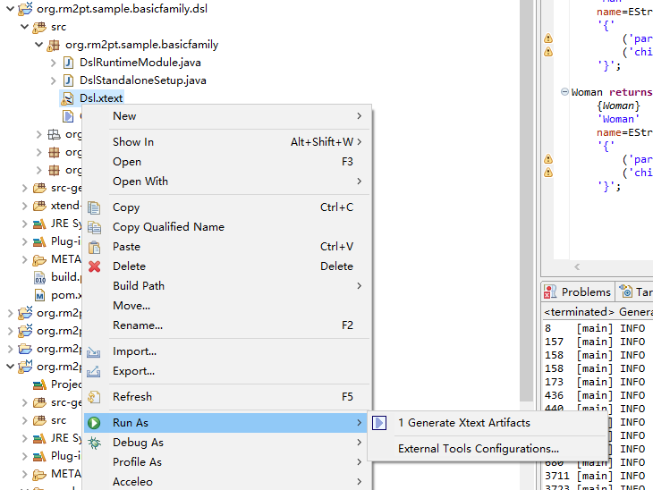

### 任务一

首先创建元模型

创建一个新的Modeling Project

选择刚刚创建的元模型

配置整个家庭并选择他们之间的关系

### 任务二

首先创建ManNode并配置属性

将WomanNode也加进来

配置fatherEdge和motherEdge，在视图中可以观察到people之间的关系

配置section，使可视化视图中可以将Man结点拖拽并配置

### 任务三

在genmodel中右键自动生成dsl文件

在对应的dsl文件自动生成Xtext文件

### 任务四

前三步执行成功后，右击pom.xml先后执行maven clean和maven build

在target中找到压缩包并导入软件

新建一个file来进行测试

输入代码后解析成功

